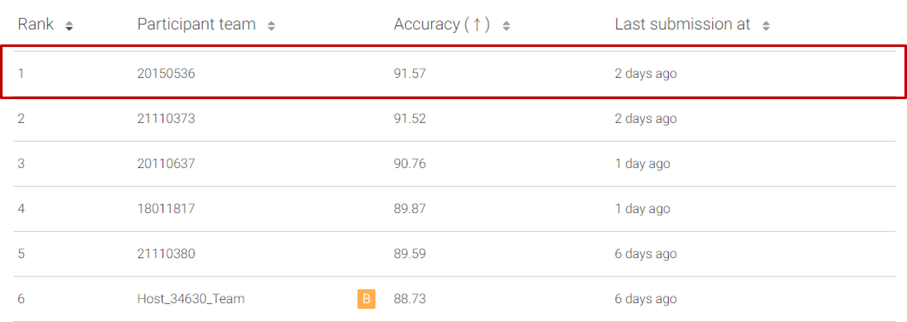

# 2021ComputerVision-Challenge14-Image Classification with Semi-Supervised Learning

##  환경구축

- `conda`를 사용해 베이라인 코드 실행에 필요한 라이브러리들을 설치함

  ```
  conda create –n pytorch1_4_env python=3.6
  conda install pytorch==1.4.0 torchvision==0.5.0 cudatoolkit=10.1 -c pytorch
  pip install tensorboard
  pip install tqdm
  ```

  

## 모델 훈련

- 아래와 같은 명령어를 통해 labeled dataset을 40장만 사용해 훈련을 진행함

```
python -m torch.distributed.launch --nproc_per_node 2 ./train.py --dataset cifar10
--num-labeled 40 --arch wideresnet --batch-size 32 --lr 0.03 --wdecay 0.001
--expand-labels --seed 5 --out results/cifar10@40
```

- 모델 훈련 시작: 모델 훈련 시작할 때 기록한 화면은 아래와 같음

  

- 모델 훈련 완료: 모델 훈련이 완료되었을 때 기록한 화면은 아래와 같음

- 화면을 통해 최종 best top-1 accuracy가 약 93.62%라는 것을 알 수 있음


## 모델 예측

- 모델 예측 진행: GitHub repository에서 제공한 result.py 파일을 이용해 훈련한 모델로 예측 진행

- 사용한 명령어는 아래와 같음

  ```
  python result.py --arch wideresnet --batch-size 64 --seed 5
  --resume results/cifar10@40/model_best.pth.tar --save here.json
  ```

- 예측이 완료되면 예측 결과가 JSON 파일로 저장됨

- 예측 결과가 저장된 JSON 파일을 Leader board에 업로드하여 성능을 측정한 결과 baseline 성능보다 높은 91.57%를 기록함



